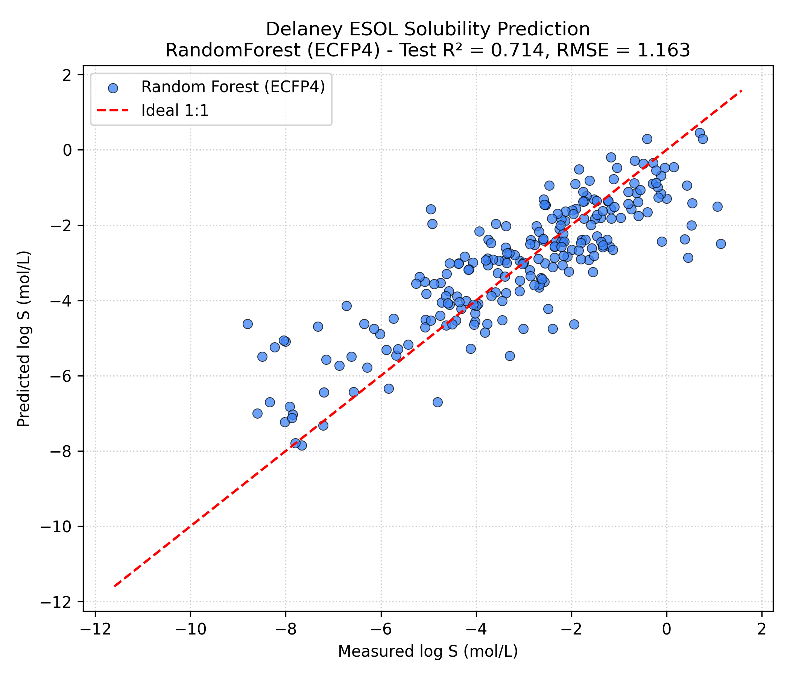

# Phase 1: Small Molecule Aqueous Solubility Prediction (Delaney ESOL Benchmark)

**Author**: Hardik Sood ([@hardiksood21](https://github.com/hardiksood21))  
**Domain**: Cheminformatics & ADME Property Prediction  
**Methodology**: RDKit Morgan Circular Fingerprints (ECFP4) + Random Forest Regression  

---

## 1. Scientific Background & Motivation

In early-stage drug discovery, aqueous solubility ($\log S$) is a pivotal **ADME** (Absorption, Distribution, Metabolism, and Excretion) property. Insufficient aqueous solubility impedes oral absorption, reduces bio-availability, leads to erratic pharmacokinetics, and often causes early candidate failure during clinical trials.

The **Delaney (ESOL)** dataset is a classical benchmark in cheminformatics containing 1,128 small organic molecules with experimentally measured aqueous solubility values in units of $\log(\text{mol/L})$. Predicting $\log S$ directly from SMILES strings allows computational screening of virtual compound libraries prior to wet-lab synthesis.

---

## 2. Methodology & Feature Engineering

### Extended-Connectivity Fingerprints (ECFP4)
Computers cannot directly interpret 2D SMILES strings as numeric tensors for traditional machine learning algorithms. We extract topological subgraphs using **Morgan Fingerprints** (equivalent to ECFP4):

1. **Atom Environment Extraction**: For each atom in a molecule, circular environments up to a topological radius of $r=2$ (bonds diameter $=4$) are captured.
2. **Substructure Hashing**: Unique integer hashes are computed for every distinct atom environment.
3. **Bit Vector Reduction**: Hash values are mapped onto a fixed **2,048-bit binary vector** using modulo folding arithmetic ($b = \text{hash} \pmod{2048}$):
   $$\mathbf{x}_i \in \{0, 1\}^{2048}$$
   - Bit $= 1$: Indicates the presence of a specific molecular fragment/subgraph.
   - Bit $= 0$: Indicates the absence of the molecular fragment.

```
SMILES String ("Cc1ccc(cc1)C(C)C") 
   ├──> RDKit Mol Representation
   ├──> Circular Fragment Hashing (r=2)
   └──> 2048-bit Morgan Fingerprint (ECFP4) Vector
```

---

## 3. Model Architecture & Data Split

- **Dataset Size**: 1,128 small molecules
- **Data Partitioning**: 80% Train Set ($N = 902$), 20% Test Set ($N = 226$), stratified with fixed seed (`random_state=42`).
- **Machine Learning Algorithm**: Ensemble `RandomForestRegressor` with 100 decision trees (`n_estimators=100`, `n_jobs=-1`).

---

## 4. Empirical Benchmark Results

| Metric | Training Set | Test Set (Independent Split) |
|:---|:---:|:---:|
| **$R^2$ Score** (Coefficient of Determination) | `0.9403` | **`0.7138`** |
| **RMSE** (Root Mean Squared Error, $\log S$) | `0.5072` | **`1.1631`** |

### Test Set Actual vs. Predicted Solubility Plot
Below is the publication-quality scatter plot comparing experimentally measured aqueous solubility vs. model predictions:



---

## 5. Repository Files

- **`solubility_model.py`**: Clean, modular Python script executing SMILES parsing, ECFP4 featurization, training, metric evaluation, and plot generation.
- **`solubility_model.ipynb`**: Interactive Jupyter / Google Colab notebook.
- **`solubility_actual_vs_predicted.png`**: High-resolution (300 DPI) evaluation graphic.

---

## 6. How to Reproduce

### Local Execution
```bash
pip install rdkit scikit-learn pandas numpy matplotlib
python solubility_model.py
```

### Google Colab Execution
Upload `solubility_model.ipynb` to Google Colab and run all cells sequentially.
