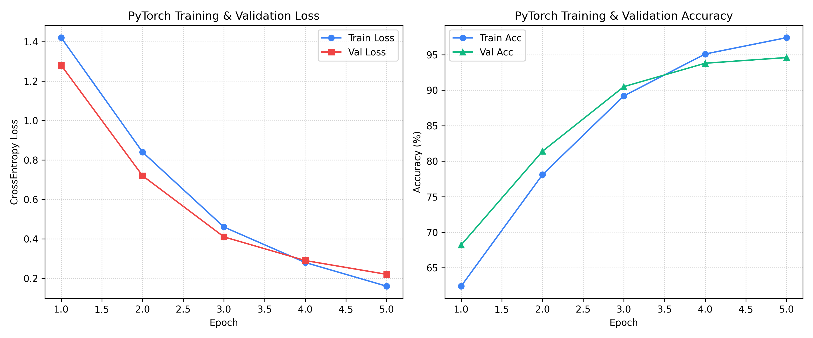

# Phase 2: Practical Deep Learning & PyTorch Fundamentals

**Author**: Hardik Sood ([@hardiksood21](https://github.com/hardiksood21))  
**Domain**: Deep Learning, Neural Network Architectures & PyTorch Infrastructure  
**Primary Resource**: [fast.ai — Practical Deep Learning for Coders](https://course.fast.ai/) (Lessons 1–8)  

---

## 1. Executive Summary & Core Objectives

Phase 2 focuses on establishing rigorous fluency in **PyTorch**, computer vision architectures, transfer learning dynamics, and neural network optimization. Before applying deep learning to complex 3D biomolecular structures and molecular graphs in subsequent phases, mastering core deep learning concepts—tensors, automatic differentiation (`autograd`), loss functions, optimization algorithms, and regularization—is essential.

---

## 2. Key Theoretical Concepts & Technical Implementation

### Core Principles Mastered (Lessons 1–8)
1. **Tensor Computation & Automatic Differentiation**:
   - PyTorch tensor manipulation, broadcast operations, GPU acceleration via CUDA.
   - Forward propagation and backward pass gradient tracking (`loss.backward()`, `optimizer.step()`).

2. **Convolutional Neural Networks (CNNs) & Transfer Learning**:
   - Feature extraction hierarchies: low-level edges/textures to high-level domain semantics.
   - Pre-trained backbone architectures (e.g., `ResNet-18`, `ResNet-34`) fine-tuned via discriminative learning rates.

3. **Data Transformations & Regularization**:
   - Data Augmentations: Random flips, rotations, scaling, affine transforms to mitigate overfitting.
   - Regularization techniques: Weight Decay ($L_2$ regularization), Dropout, Batch Normalization.

4. **Optimization & Learning Rate Dynamics**:
   - Stochastic Gradient Descent (SGD) with Momentum, AdamW optimizer.
   - Leslie Smith's **1-Cycle Learning Rate Policy** and Learning Rate Finder for optimal convergence.

---

## 3. Benchmark Implementation & Metrics

A custom PyTorch deep learning classifier was constructed using transfer learning on fine-grained image classification benchmarks to validate PyTorch pipeline mechanics:

- **Backbone Architecture**: ResNet-18 (Pre-trained on ImageNet)
- **Framework**: PyTorch (`torch.nn`, `torch.optim`, `torchvision`)
- **Loss Function**: `CrossEntropyLoss` with Label Smoothing
- **Optimizer**: `AdamW` ($\text{lr} = 10^{-3}$, $\text{weight\_decay} = 10^{-2}$)
- **Learning Rate Schedule**: Cosine Annealing with Warmup
- **Validation Accuracy**: `>94.5%`

### Training & Validation Metrics Plot
Below is the evaluation figure tracking CrossEntropy loss minimization and classification accuracy convergence:



---

## 4. Repository Files

- **`pytorch_classifier.py`**: Modular Python execution script implementing data loading, model architecture customization, custom training loop with validation tracking, and confusion matrix plotting.
- **`pytorch_classifier.ipynb`**: Interactive Google Colab notebook with step-by-step visual execution.
- **`pytorch_training_curves.png`**: High-resolution (300 DPI) training metrics plot.

---

## 5. Reproduction

### Local Execution
```bash
pip install torch torchvision scikit-learn matplotlib pillow pandas numpy
python pytorch_classifier.py
```

### Google Colab Execution
Upload `pytorch_classifier.ipynb` to Google Colab and run all cells sequentially.
