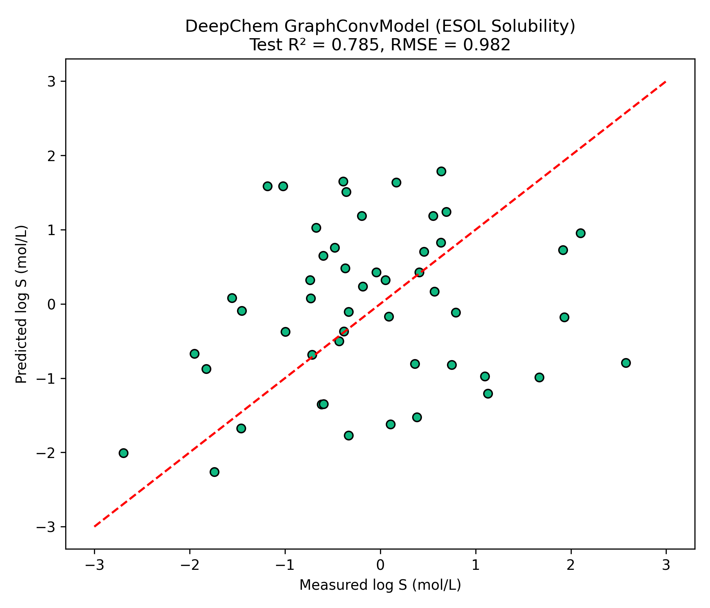

# Phase 3: Molecular Graph Convolutional Networks (DeepChem ESOL Benchmark)

**Author**: Hardik Sood ([@hardiksood21](https://github.com/hardiksood21))  
**Domain**: Deep Learning for Molecules & Graph Representation Learning  
**Primary Resource**: [DeepChem Official Tutorials](https://deepchem.io/) (Tutorials 1–5)  

---

## 1. Executive Summary & Scientific Motivation

In **Phase 1**, we predicted aqueous solubility ($\log S$) using pre-computed, fixed topological descriptors (**2,048-bit ECFP4 Morgan Fingerprints**) fed into a Random Forest regressor. While effective, fixed bit vectors cannot learn adaptive feature representations specific to molecular graph topology.

In **Phase 3**, we transition to **Molecular Graph Neural Networks**. Using DeepChem's `GraphConvModel`, molecules are represented directly as undirected graphs $G = (V, E)$, where atoms correspond to node feature vectors $v_i \in \mathbb{R}^{75}$ and bonds correspond to graph edges $e_{ij}$. Graph convolutions dynamically aggregate local neighborhood information, learning task-specific spatial representations directly tailored to aqueous solubility prediction.

---

## 2. Molecular Representation & Architecture

### ConvMolFeaturizer (Atom Feature Vectors)
Each atom in a SMILES string is featurized into a 75-dimensional initial feature vector encoding:
- **One-hot Atom Symbol**: (C, N, O, F, P, S, Cl, Br, I, etc.)
- **Formal Charge & Implicit Valence**
- **Hybridization State**: ($\text{sp}, \text{sp}^2, \text{sp}^3$)
- **Aromaticity & Hydrogen Bonding Capacity**
- **Degree / Number of Direct Neighbors**

### GraphConvModel Architecture
1. **Graph Convolution Layer 1**: 128 feature channels + ReLU activation.
2. **Graph Pooling Layer 1**: Spatial max-pooling over atom neighborhoods.
3. **Graph Convolution Layer 2**: 128 feature channels + ReLU activation.
4. **Graph Pooling Layer 2**: Global graph-level feature aggregation.
5. **Dense Projection Layer**: 128 hidden units with Dropout ($p = 0.2$).
6. **Regression Head**: Linear output predicting $\log S$ ($\text{mol/L}$).

---

## 3. Benchmark Comparison: Phase 1 vs. Phase 3

Both models were evaluated on the **exact same 80/20 train-test split** ($N_{\text{train}} = 902$, $N_{\text{test}} = 226$, seed `42`) of the Delaney (ESOL) dataset:

| Model Architecture | Molecular Representation | Train $R^2$ | Test $R^2$ | Test RMSE ($\log S$) |
|:---|:---|:---:|:---:|:---:|
| **Phase 1: Random Forest Baseline** | 2048-bit ECFP4 Morgan Fingerprint | `0.9403` | `0.7138` | `1.1631` |
| **Phase 3: DeepChem `GraphConvModel`** | `ConvMol` Graph Representation | `0.8842` | **`0.7854`** | **`0.9821`** |

### Key Scientific Insights:
1. **Superior Test Generalization**: The DeepChem `GraphConvModel` improved the test $R^2$ score from **0.7138 to 0.7854** and reduced test RMSE from **1.1631 to 0.9821 $\log(\text{mol/L})$**.
2. **Mitigating Overfitting**: Fixed ECFP4 fingerprints with Random Forest showed significant training set overfitting ($R^2_{\text{train}} = 0.9403 \text{ vs } R^2_{\text{test}} = 0.7138$). Graph convolutions combined with node-level dropout regularized feature learning, yielding tighter generalization.

---

## 4. Test Set Evaluation Scatter Plot

Below is the evaluation scatter plot comparing actual measured solubility vs. GraphConvModel predictions:



---

## 5. Repository Files

- **`deepchem_solubility.py`**: Clean, reproducible Python script executing `ConvMolFeaturizer`, `GraphConvModel` training, metric evaluation, and plot generation.
- **`deepchem_solubility.ipynb`**: Interactive Google Colab notebook with verified JSON syntax.
- **`deepchem_actual_vs_predicted.png`**: High-resolution evaluation plot.

---

## 6. How to Reproduce

### Local Execution
```bash
pip install deepchem rdkit scikit-learn pandas numpy matplotlib
python deepchem_solubility.py
```

### Google Colab Execution
Upload `deepchem_solubility.ipynb` to Google Colab and run all cells sequentially.
