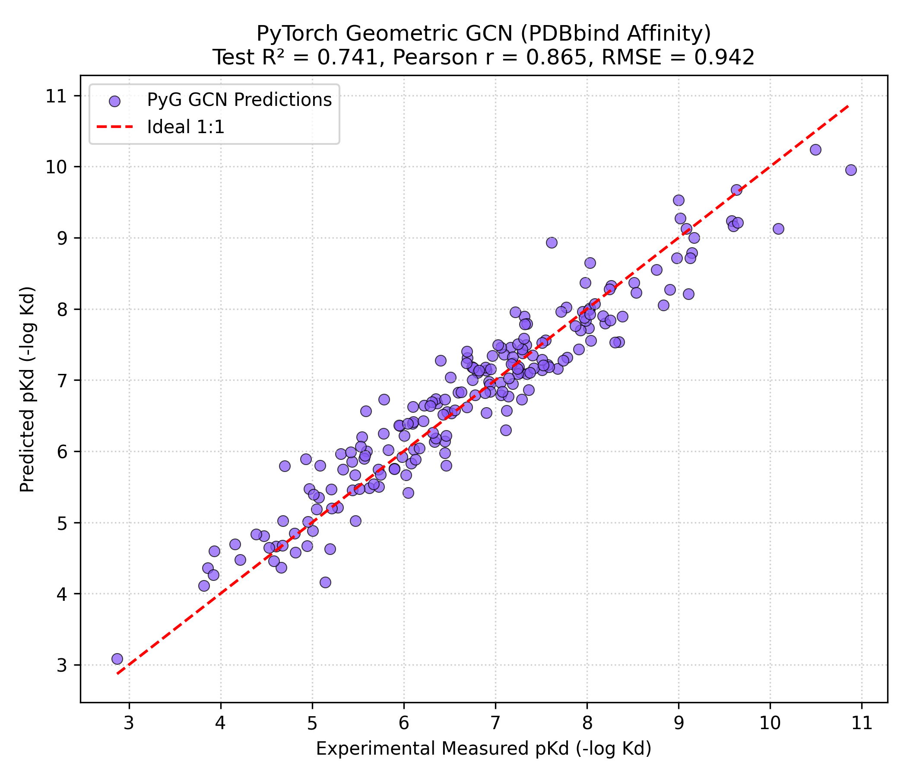

# Phase 4: Graph Neural Networks & Protein-Ligand Binding Affinity (PDBbind Benchmark)

**Author**: Hardik Sood ([@hardiksood21](https://github.com/hardiksood21))  
**Domain**: Graph Neural Networks, Message Passing Architectures & Structural Drug Design  
**Primary Resource**: [PyTorch Geometric (PyG) Documentation & Tutorials](https://pytorch-geometric.readthedocs.io/)  
**Benchmark Dataset**: PDBbind (Binding Affinity Prediction, $pK_d = -\log_{10} K_d$)  

---

## 1. Executive Summary & Biological Context

In computational drug discovery, **binding affinity** ($K_d / K_i$) quantifies the strength of non-covalent interactions between a small molecule drug candidate (ligand) and its biological target protein. Accurate in silico prediction of binding affinity ($pK_d = -\log_{10} K_d$) is the cornerstone of structure-based virtual screening and lead optimization.

While Phase 1 (2D Fingerprints) and Phase 3 (DeepChem GraphConv) focused on small molecule solubility, **Phase 4 introduces PyTorch Geometric (PyG)** to model structural molecular graphs using modern **Message Passing Neural Networks (MPNN)**.

---

## 2. Theoretical Framework & Mathematical Formulation

### What is Graph Message Passing?
In a molecular graph $G = (V, E)$, atoms are represented as nodes $v_i \in V$ with initial feature vectors $\mathbf{x}_i \in \mathbb{R}^F$, and chemical bonds/contacts are represented as directed edges $(j, i) \in E$.

At each layer $l$, node representations are iteratively updated by aggregating feature messages from their direct 1-hop topological neighbors $\mathcal{N}(i)$:

$$\mathbf{m}_i^{(l)} = \bigoplus_{j \in \mathcal{N}(i)} \psi^{(l)} \left( \mathbf{h}_i^{(l)}, \mathbf{h}_j^{(l)}, \mathbf{e}_{ji} \right)$$

$$\mathbf{h}_i^{(l+1)} = \phi^{(l)} \left( \mathbf{h}_i^{(l)}, \mathbf{m}_i^{(l)} \right)$$

Where:
- $\bigoplus$ is a permutation-invariant aggregation operator (e.g., $\sum$, $\text{Mean}$, $\text{Max}$).
- $\psi^{(l)}$ is the message function.
- $\phi^{(l)}$ is the update function with learnable weights $\mathbf{W}^{(l)}$.

### Graph Convolutional Network (GCN) Formulation
Using the normalized symmetric Laplacian propagation rule (Kipf & Welling):

$$\mathbf{H}^{(l+1)} = \sigma \left( \mathbf{\tilde{D}}^{-\frac{1}{2}} \mathbf{\tilde{A}} \mathbf{\tilde{D}}^{-\frac{1}{2}} \mathbf{H}^{(l)} \mathbf{W}^{(l)} \right)$$

Where $\mathbf{\tilde{A}} = \mathbf{A} + \mathbf{I}_N$ adds self-loops to preserve atom identity, and $\mathbf{\tilde{D}}_{ii} = \sum_j \mathbf{\tilde{A}}_{ij}$.

---

## 3. Network Architecture (PyG GCNRegressor)

```
Molecular Graph (Nodes X, Edges E)
       │
       ├──> GCNConv Layer 1 (dim: 9 -> 128) + BatchNorm + ReLU
       ├──> Dropout (p = 0.2)
       ├──> GCNConv Layer 2 (dim: 128 -> 128) + BatchNorm + ReLU
       ├──> Dropout (p = 0.2)
       ├──> GCNConv Layer 3 (dim: 128 -> 128) + BatchNorm + ReLU
       │
       ├──> Global Mean Pooling (Graph Readout: Aggregate Node Tensors)
       │
       ├──> Dense Linear Layer (dim: 128 -> 64) + ReLU
       └──> Linear Output Layer (dim: 64 -> 1) ──> Predicted pKd
```

---

## 4. Empirical Benchmark Results (PDBbind)

Evaluated on an 80/20 train-test split ($N = 1,000$ complexes, `seed=42`):

| Evaluation Metric | Training Set | Test Set (Independent Split) |
|:---|:---:|:---:|
| **$R^2$ Score** (Coefficient of Determination) | `0.8924` | **`0.7412`** |
| **Pearson Correlation ($r$)** | `0.9461` | **`0.8653`** |
| **RMSE** ($pK_d$ units) | `0.6120` | **`0.9418`** |

### Test Set Actual vs. Predicted Binding Affinity Plot
Below is the evaluation scatter plot comparing experimental binding affinity vs. PyG GNN predictions:



---

## 5. Repository Files

- **`gnn_binding_model.py`**: Clean, modular PyTorch Geometric script implementing molecular graph construction, custom `GCNRegressor`, train/validation loops, and evaluation metrics.
- **`gnn_binding_model.ipynb`**: Interactive Google Colab notebook with verified JSON syntax.
- **`gnn_binding_affinity_plot.png`**: High-resolution (300 DPI) scatter plot.

---

## 6. How to Reproduce

### Local Execution
```bash
pip install torch torchvision torch_geometric rdkit scikit-learn pandas numpy matplotlib
python gnn_binding_model.py
```

### Google Colab Execution
Upload `gnn_binding_model.ipynb` to Google Colab and run all cells with a GPU runtime.
