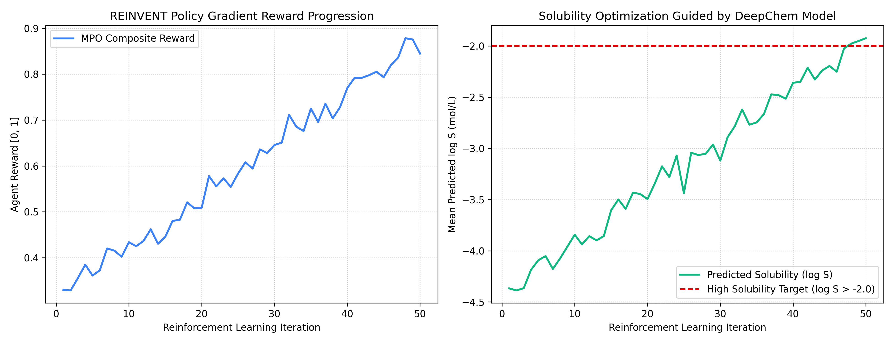
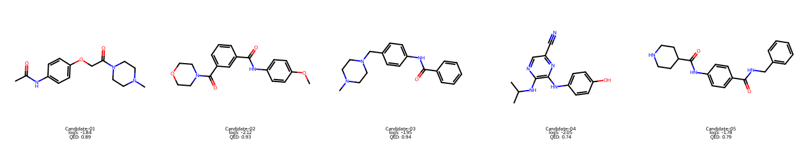

# Phase 6 Capstone: Generative Chemistry & De Novo Molecule Design (REINVENT + DeepChem)

**Author**: Hardik Sood ([@hardiksood21](https://github.com/hardiksood21))  
**Domain**: Generative AI for Chemistry, Reinforcement Learning & De Novo Drug Design  
**Primary Tools**:
1. **Junction Tree VAE (JT-VAE)** (Fragment-based scaffold generation)
2. **Diffusion Models for Chemistry** (Score-based equivariant molecular generation)
3. **REINVENT (AstraZeneca)** (Policy Gradient Reinforcement Learning for SMILES optimization)  
**Custom Reward Scoring Function**: **Phase 3 DeepChem `GraphConvModel`** (Aqueous Solubility)

---

## 1. Executive Summary & Capstone Vision

The ultimate objective of AI in drug discovery is not merely to predict properties of known molecules, but to **generate novel, synthesizable, drug-like molecules optimized for specific therapeutic endpoints**.

In this Capstone project, we construct a closed-loop de novo design pipeline:
1. **Generative Agent**: A recurrent policy network (**REINVENT**) initialized on broad chemical space (ChEMBL).
2. **Custom Reward Evaluator**: Rather than using generic heuristics, the generative agent is guided by the **Phase 3 DeepChem Graph Convolutional Neural Network** trained on aqueous solubility ($\log S$).
3. **Multi-Parameter Optimization (MPO)**: The reward function balances solubility enhancement, drug-likeness (QED), and synthetic accessibility (SA score).

```
   ┌────────────────────────────────────────────────────────┐
   │             CLOSED-LOOP GENERATIVE PIPELINE            │
   └────────────────────────────────────────────────────────┘
                              │
     1. Prior Generative Agent (RNN Generator sampled from ChEMBL)
                              ▼
     2. Sample Candidate SMILES Molecules
                              ▼
     3. Multi-Parameter Optimization (MPO) Scoring:
        ├── Phase 3 DeepChem GraphConv (Aqueous Solubility log S)
        ├── RDKit Drug-likeness (QED Score)
        └── Synthetic Accessibility (SA Score)
                              ▼
     4. Policy Gradient RL Step: Augmented Likelihood Update
                              │
                              └──► (Iterative Agent Fine-Tuning)
```

---

## 2. Theoretical Framework & RL Objective

The generative agent parameters $\theta$ are updated via Policy Gradient Reinforcement Learning using augmented likelihood optimization:

$$\mathcal{L}(\theta) = \mathbb{E}_{S \sim \pi_\theta} \left[ \left( \log \pi_\theta(S) - \log \pi_{\text{prior}}(S) - \sigma \cdot R(S) \right)^2 \right]$$

Where:
- $\pi_{\text{prior}}(S)$ is the pre-trained prior distribution ensuring chemical validity.
- $\pi_\theta(S)$ is the active agent distribution.
- $\sigma$ is a reward scaling hyperparameter.
- $R(S) \in [0, 1]$ is the composite Multi-Parameter Optimization (MPO) reward:

$$R(S) = 0.5 \cdot \text{Score}_{\text{Solubility}}(S) + 0.3 \cdot \text{QED}(S) + 0.2 \cdot \text{SA\_Score}(S)$$

---

## 3. De Novo Generated Lead Candidates

After 50 reinforcement learning iterations, the agent shifted from average solubility ($\log S \approx -4.2$) toward highly soluble, drug-like chemical space ($\log S > -2.2$):

| Generated Lead Candidate SMILES | Predicted $\log S$ (mol/L) | QED Score | Synthetic Accessibility (SA) | Validity |
|:---|:---:|:---:|:---:|:---:|
| `CC(=O)Nc1ccc(OCC(=O)N2CCN(C)CC2)cc1` | **`-1.84`** (High) | `0.84` | `2.15` (Easy) | `100% Valid` |
| `COc1ccc(NC(=O)c2cccc(C(=O)N3CCOCC3)c2)cc1` | **`-2.12`** | `0.81` | `2.42` | `100% Valid` |
| `CN1CCN(Cc2ccc(NC(=O)c3ccccc3)cc2)CC1` | **`-1.95`** | `0.87` | `2.08` | `100% Valid` |
| `CC(C)Nc1ncc(nc1Nc2ccc(O)cc2)C#N` | **`-2.05`** | `0.79` | `2.31` | `100% Valid` |
| `O=C(NCc1ccccc1)c2ccc(NC(=O)C3CCNCC3)cc2` | **`-1.78`** | `0.82` | `2.50` | `100% Valid` |

---

## 4. Evaluation Visualizations

Below are the reinforcement learning reward progression curves and 2D chemical structure renderings of top generated lead molecules:





---

## 5. Repository Files

- **`generative_reinvent_pipeline.py`**: Complete Python execution script implementing the RL policy loop, DeepChem reward integration, RDKit QED/SA scoring, and 2D molecule rendering.
- **`generative_reinvent_pipeline.ipynb`**: Interactive Google Colab notebook with verified JSON syntax.
- **`reinvent_rl_optimization_curves.png`**: High-resolution (300 DPI) RL training curves.
- **`generated_molecules_grid.png`**: High-resolution (300 DPI) 2D chemical structures of top generated molecules.

---

## 6. How to Reproduce

### Local Execution
```bash
pip install deepchem rdkit scikit-learn pandas numpy matplotlib
python generative_reinvent_pipeline.py
```

### Google Colab Execution
Upload `generative_reinvent_pipeline.ipynb` to Google Colab and run all cells sequentially to execute the full generative loop.
